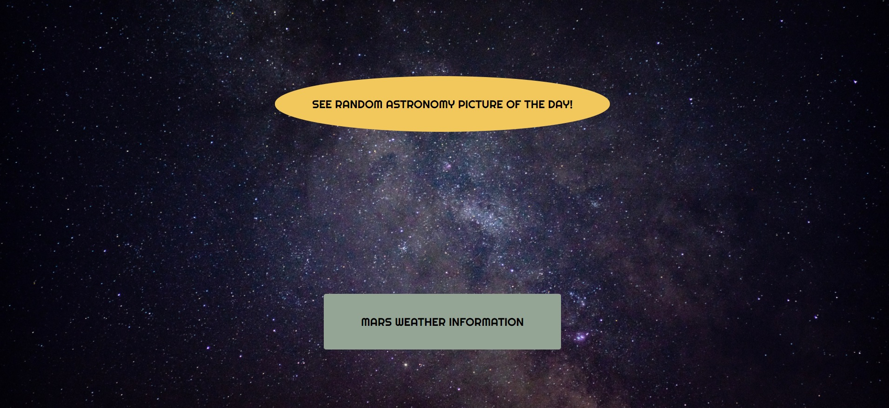
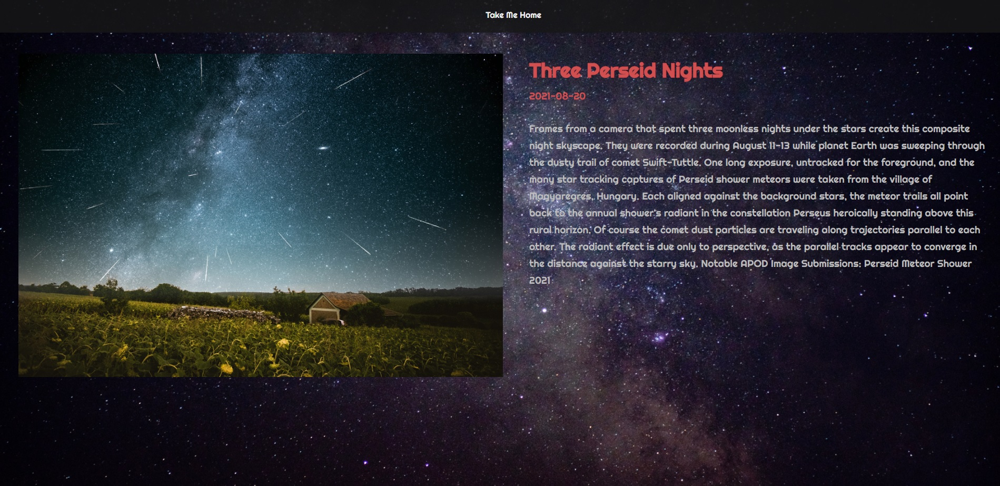

# Space Exploration App

- using NASA API: random astronomy picture of the day and other data requests

# Screenshots

## Homepage with react-router-dom

## Random Astro Picture of the Day and Description

## Run

- run npm start
